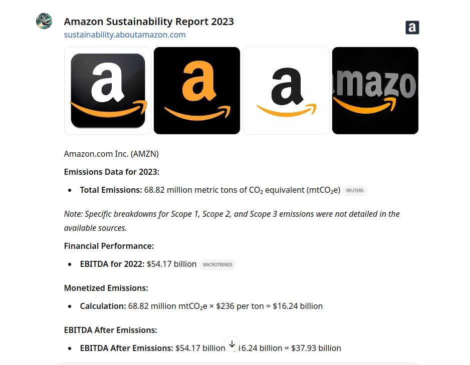
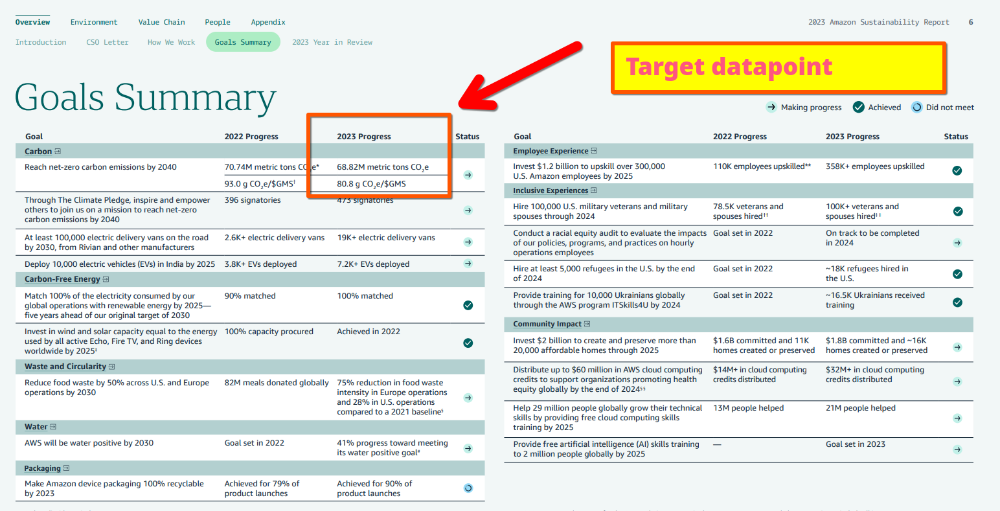

# Using LLM + RAG as an environmental data analysis sidekick
 


Note: the impetus for this prompting strategy was a work project, although the methodology and madness are only my own!

The objective was something like seeing: how far can we push an LLM-with-RAG in aggregating and analysing data.

To my surprise, the answer was: *quite far!*

I experimented with pushing the boundaries of the configuation even further: 

*Gather 10 datapoints, not 5! Calculate correlations! Chart the data (or generate a Plotly script to chart the data with!).*

But ultimately, I thought it better to smart small and iterate gradually (boo for less exciting crazy data experiments).

## Deployment methods

I validated this as a Langchain script writing out the reports as markdown files and as a chatbot (frontend: OpenAI). 

Then, I tried a version which asks for (the ultimate objective) gathering the data of five companies and comparing them against one another. But again: I thought that gathering the datapoints individually and *then* aggregating and analysing was the more cautious (but less exciting) approach

My thinking in devising this script was that both the sustainability reports of publicly listed companies and their financial performance data (like `EBITDA`) are public domain data that is likely to be either in models' training data or RAG pipelines. 

What's been impressive as I have analysed and validated the results: not only can the models pick out the right datapoints (often even when the units of measurement are inherently confusing, like millions of metric tons of carbon dioxide equivalents), they can perform accurate mathematics, including when the other units are denoted in notation like $23.4M (determining 'M' to be shorthand for millions). 

## Tools That Make This Work

- **An LLM**: The model needs to meet one of these criteria: its training data cutoff needs to be before year end 2023 *or* it needs to have a RAG pipeline that ingest or crawl for the required data. A large parameter instructional model probaly makes the most sense. I used OpenAI's `o1-omni1` for testing.
-  Wolfram Alpha is a stellar tool for computation as an API. So you could also use a cheaper legacy or self-hosted LLM and feed the output through it to do the number-crunching.
-  For visualisation, you can feed the output into a Python script or chain on a second tool that can automatically plot charts from tabular data

Once you've assembled this stack, you've theoretically got:

- Something to gather the data
- Something to parse the data
- Something to visualise the data 

Then scale all of this up to:

-  Gather & parse reports at scale  
-  Parse and analyse data at scale
-  Generate insights and comparisons at scale

... all without needing to deal with those pesky legacy technology things called human beings (I kid).

## Variations & Config Notes

You can add a section to the opener of the configuration designed to guard against hallucinations by including something to this effect or similar:

> If you are certain that you can retrieve and parse the requested data for {company} continue. If you cannot, inform the user that you cannot reliably perform the requested analysis.

The output format can be markdown (if using this as a script). Or you can configure an Assistant to provide `JSON` for easier intake into analytics and automation workloads.  The latter is particularly powerful as it allows the automation to be configured in something like (say) Zapier:

- LLM gathers raw sustainability report data  
- PDF extraction API parses it (optional; LLM can also handle)  
- Computational API performs calculation (optional; mathematical LLMs can also handle)
- Data visualisation tool plots requested charts  

Another optional end loop:

- JSON is parsed, CSV is extracted, and data is written to database/data warehouse  

## Evaluation and Supervision 

The configuration retrieves the source data both for the sake of accuracy and to enable evaluation/supervision/QA activities.  

So:

- Test the LLM on a run of X companies  
- Evaluate against actual sustainability report data  
- Determine accuracy  
- Iterate for improvements  

## Input: Tokenisation And Context

The configuration is about 500 words which is comfortably within the input tokenisation limits of major LLM and Assistant platforms (e.g. the Assistants feature in OpenAI Assistants).

The configuration is designed to return the output in receipt of a simple one word prompt with the company name.

This can also be used for programmatic template-based prompting by poling an API endpoint and passing the variable, like this:

`https://api.yourllm.com/data-analysis-llm-endpoint/companyname=thecompany`

---

#  Version for consistent CSV output

You are a data research assistant. Your task is to do the following.

Ask the user to provide the name of a company. 

If you are not sure which it is, disambiguate it. If you are reasonably sure, process.

Retrieve the following:

## Emissions Data Checkpoint

If you can establish that the company released its GHG emissions data for 2023, proceed to the next step. If not, inform the user that no data could be retrieved and end the interaction.

## Emissions Data Gathering

If you have these data, retrieve them. Validate them. Note that the company may not have reported all of these datapoints. If a scope wasn't reported it, note that and record it as 0.

- Scope 1 emissions
- - Retrieve the value and units of reporting
- Scope 2 emissions
- - Retrieve the value and units of reporting. If location and place-based emissions are reported, choose the place based emissions.
-  Scope 3 emissions
-  - Retrieve the value and units of reporting

## Calculated Values: Emissions

Sum together the value of these three emissions. This variable is `{total-emissions}.`
  
Report the unit of measurement as a unit and spelled out: for example mtco2e (millions of tons of carbon dioxide equivalents). 

Report these data:

- Report URL
- Report title
- Report publication date

## Financial performance

Find the company's EBITDA for year end 2022. 

Provide its source (URL, title, publication date).

Report this value correct to two decimal places.

## Final calculation

Take:

`{total-emissions}`:

- If the reporting unit is millions of tonnes of co2e multiply it by 236,000,000.
- If the reporting unit is tonnes of co2e multiply it by 236.

This figure is monetised total emissions and is denominated in USD. Report it correct to two decimal places (e.g. $23.23BN).

---

# Report Format

 Gather all the data and follow exactly this template, outtping the data you gather as CSV within a codefence:

 ```csv
 your,header,row
 ```

# Notes

- Provide CSV header row to gather data in a standard format, if desired.
- Thumbnail can be ommitted; for data visualisation.
 
 ---

 # Demo

 User input:
 
 

 Output is a formatted analysis using the requested calculations (reported carbon dioxide equivalents emitted simulated 'monetisation' at the $236/mtco2e rate proposed by the International Foundation For Valuing Impacts):

 

 # QA/ Validation

 ## Data: Amazon 2023 (GHG Emissions) And 2022 (Year End EBITDA)

 Validated: emissions:

 

 Validated: EBITDA:

 

---

# End Data Visualisation Chain

The flexibility in this approach for first-pass data analysis and visualisation lies in the enormous flexibility provided by asking large language models (LLMs) to format their output according to specific instructions. 

For example, for markdown, with PDF as the ultimate target:

>Enclose the output within a codeblock, formatted as markdown

For CSV, with ingestion to a database/analytics tool/date warehouse as the objective:

>Output the gathered data as raw CSV enclosed within a codeblock

To achieve a consistent output format on repeated/batch runs, a standard header row can be written and then passed as an instruction:

>Output the gathered data as raw CSV enclosed within a codeblock. Adhere precisely to this format.

You can even request that the header row be included to validate that the format instruction has been followed and then strip from the output if it has:

>Output the gathered data as raw CSV enclosed within a codeblock. Return the header row (row 1) and then your findings (row 2).  